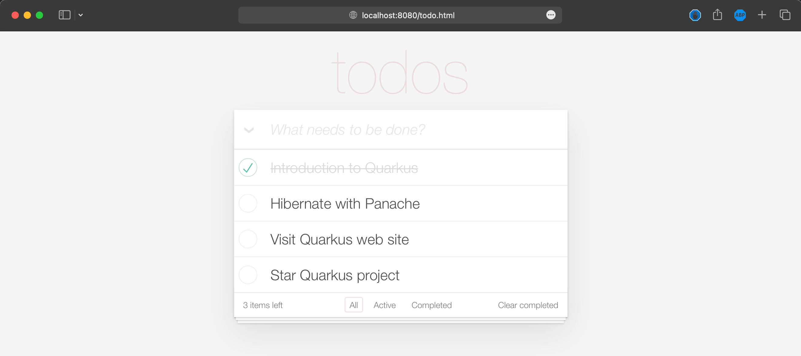

# Externalize Application Configurations

1. Run a PostgreSQL database container with different username and password.

   ```sh
   docker run --name todo-db \
   -e POSTGRES_USER=dbuser \
   -e POSTGRES_PASSWORD=dbpassword \
   -e POSTGRES_DB=todo \
   --network quarkus-todo \
   -v $(pwd)/etc/init-db.sql:/docker-entrypoint-initdb.d/init-db.sql \
   -d --rm postgres
   ```

2. Run the applcation container again and set application configurations via environment variables for PostgreSQL database connection. The application should be started and run without any error.

   ```sh
   docker run --rm -it -p 8080:8080  \
   -e quarkus.datasource.username=dbuser \
   -e quarkus.datasource.password=dbpassword \
   --network quarkus-todo \
   docker.io/audomsak/quarkus-todo-app:1.0
   ```

3. Open `http://localhost:8080` URL in a web browser, you should see a webpage like this screenshot which means the application is working as expected.

    

4. Press `Ctrl+C` to stop and exit from application container

    _Example Output_

    ```sh
    ^C2023-02-27 08:56:33,780 INFO  [io.quarkus] (main) quarkus-todo-apps stopped in 0.079s
    ```

5. Stop PostgreSQL database container

    ```sh
    docker stop todo-db
    ```
