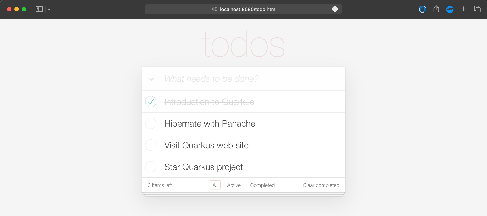

# Running Application Container

1. Create and run a container from the container image.

   ```sh
   docker run --rm -it -p 8080:8080  docker.io/audomsak/quarkus-todo-app:1.0
   ```

   The application can be started and run. However, you can see the logs complaining about database connection error. That's because the application has a dependency with PostgreSQL database so we have to start an instance of PostgreSQL first.

   Press `Ctrl+C` To stop the application (and contianer).

   _Example Output_

   ```sh
   exec java -Dquarkus.http.host=0.0.0.0 -Djava.util.logging.manager=org.jboss.logmanager.LogManager -XX:+ExitOnOutOfMemoryError -cp . -jar /deployments/app.jar
   ______          __         ___
   /_  __/___  ____/ /___     /   |  ____  ____
   / / / __ \/ __  / __ \   / /| | / __ \/ __ \
   / / / /_/ / /_/ / /_/ /  / ___ |/ /_/ / /_/ /
   /_/  \____/\__,_/\____/  /_/  |_/ .___/ .___/
                               /_/   /_/
               Powered by Quarkus 2.16.3.Final
   2023-02-27 07:26:58,718 INFO  [io.agr.pool] (main) Datasource '<default>': Initial size smaller than min. Connections will be created when necessary
   2023-02-27 07:26:59,279 WARN  [io.agr.pool] (agroal-11) Datasource '<default>': The connection attempt failed.
   2023-02-27 07:26:59,281 WARN  [org.hib.eng.jdb.env.int.JdbcEnvironmentInitiator] (JPA Startup Thread) HHH000342: Could not obtain connection to query metadata: org.postgresql.util.PSQLException: The connection attempt failed.
           at org.postgresql.core.v3.ConnectionFactoryImpl.openConnectionImpl(ConnectionFactoryImpl.java:354)
           at org.postgresql.core.ConnectionFactory.openConnection(ConnectionFactory.java:54)
           at org.postgresql.jdbc.PgConnection.<init>(PgConnection.java:253)
           at org.postgresql.Driver.makeConnection(Driver.java:434)
           at org.postgresql.Driver.connect(Driver.java:291)
           at io.agroal.pool.ConnectionFactory.createConnection(ConnectionFactory.java:226)
           at io.agroal.pool.ConnectionPool$CreateConnectionTask.call(ConnectionPool.java:535)
           at io.agroal.pool.ConnectionPool$CreateConnectionTask.call(ConnectionPool.java:516)
           at java.base/java.util.concurrent.FutureTask.run(FutureTask.java:264)
           at io.agroal.pool.util.PriorityScheduledExecutor.beforeExecute(PriorityScheduledExecutor.java:75)
           at java.base/java.util.concurrent.ThreadPoolExecutor.runWorker(ThreadPoolExecutor.java:1134)
           at java.base/java.util.concurrent.ThreadPoolExecutor$Worker.run(ThreadPoolExecutor.java:635)
           at java.base/java.lang.Thread.run(Thread.java:833)
   Caused by: java.net.UnknownHostException: todo-db
           at java.base/sun.nio.ch.NioSocketImpl.connect(NioSocketImpl.java:567)
           at java.base/java.net.SocksSocketImpl.connect(SocksSocketImpl.java:327)
           at java.base/java.net.Socket.connect(Socket.java:633)
           at org.postgresql.core.PGStream.createSocket(PGStream.java:243)
           at org.postgresql.core.PGStream.<init>(PGStream.java:98)
           at org.postgresql.core.v3.ConnectionFactoryImpl.tryConnect(ConnectionFactoryImpl.java:132)
           at org.postgresql.core.v3.ConnectionFactoryImpl.openConnectionImpl(ConnectionFactoryImpl.java:258)
           ... 12 more

   2023-02-27 07:27:00,220 INFO  [io.qua.sma.ope.run.OpenApiRecorder] (main) CORS filtering is disabled and cross-origin resource sharing is allowed without restriction, which is not recommended in production. Please configure the CORS filter through 'quarkus.http.cors.*' properties. For more information, see Quarkus HTTP CORS documentation
   2023-02-27 07:27:00,499 INFO  [io.quarkus] (main) quarkus-todo-apps 1.0.0 on JVM (powered by Quarkus 2.16.3.Final) started in 5.339s. Listening on: http://0.0.0.0:8080
   2023-02-27 07:27:00,499 INFO  [io.quarkus] (main) Profile prod activated.
   2023-02-27 07:27:00,500 INFO  [io.quarkus] (main) Installed features: [agroal, cdi, hibernate-orm, hibernate-orm-panache, hibernate-validator, jdbc-postgresql, micrometer, narayana-jta, resteasy, resteasy-jsonb, smallrye-context-propagation, smallrye-health, smallrye-openapi, vertx]
   ^C2023-02-27 07:27:47,423 INFO  [io.quarkus] (Shutdown thread) quarkus-todo-apps stopped in 0.073s
   ```

2. To allow a communication between the application container and database container, we have to create a new private Docker network by running this command.

   ```sh
   docker network create quarkus-todo
   ```

   _Example Output_

   ```sh
   efdf5c78cd423a021108dda21c7a141d4e8627b68dd8787943ad374f2cf44538
   ```

3. Run a PostgreSQL database container within the network we've just created above

   ```sh
   docker run --name todo-db \
   -e POSTGRES_USER=todo \
   -e POSTGRES_PASSWORD=todoPassword \
   -e POSTGRES_DB=todo \
   --network quarkus-todo \
   -v $(pwd)/etc/init-db.sql:/docker-entrypoint-initdb.d/init-db.sql \
   -d --rm postgres
   ```

   _Example Output_

   ```sh
    33cc043b7fbec34e36e85c0fdf85b1447dac5082f61d2296e13fbee1a4e2cb5c
   ```

4. Run the applcation container again within the same network as PostgreSQL database container. The application should be started and run without any error.

   ```sh
   docker run --rm -it -p 8080:8080  --network quarkus-todo docker.io/audomsak/quarkus-todo-app:1.0
   ```

   _Example Output_

   ```sh
   exec java -Dquarkus.http.host=0.0.0.0 -Djava.util.logging.manager=org.jboss.logmanager.LogManager -XX:+ExitOnOutOfMemoryError -cp . -jar /deployments/app.jar
   ______          __         ___
   /_  __/___  ____/ /___     /   |  ____  ____
   / / / __ \/ __  / __ \   / /| | / __ \/ __ \
   / / / /_/ / /_/ / /_/ /  / ___ |/ /_/ / /_/ /
   /_/  \____/\__,_/\____/  /_/  |_/ .___/ .___/
                               /_/   /_/
               Powered by Quarkus 2.16.3.Final
   2023-02-27 08:27:41,084 INFO  [io.agr.pool] (main) Datasource '<default>': Initial size smaller than min. Connections will be created when necessary
   2023-02-27 08:27:41,809 INFO  [io.qua.sma.ope.run.OpenApiRecorder] (main) CORS filtering is disabled and cross-origin resource sharing is allowed without restriction, which is not recommended in production. Please configure the CORS filter through 'quarkus.http.cors.*' properties. For more information, see Quarkus HTTP CORS documentation
   2023-02-27 08:27:41,992 INFO  [io.quarkus] (main) quarkus-todo-apps 1.0.0 on JVM (powered by Quarkus 2.16.3.Final) started in 2.972s. Listening on: http://0.0.0.0:8080
   2023-02-27 08:27:41,993 INFO  [io.quarkus] (main) Profile prod activated.
   2023-02-27 08:27:41,993 INFO  [io.quarkus] (main) Installed features: [agroal, cdi, hibernate-orm, hibernate-orm-panache, hibernate-validator, jdbc-postgresql, micrometer, narayana-jta, resteasy, resteasy-jsonb, smallrye-context-propagation, smallrye-health, smallrye-openapi, vertx]
   ```

5. Open `http://localhost:8080` URL in a web browser, you should see a webpage like this screenshot which means the application is working as expected.

    

6. Press `Ctrl+C` to stop and exit from application container

    _Example Output_

    ```sh
    ^C2023-02-27 08:56:33,780 INFO  [io.quarkus] (main) quarkus-todo-apps stopped in 0.079s
    ```

7. Stop PostgreSQL database container

    ```sh
    docker stop todo-db
    ```
