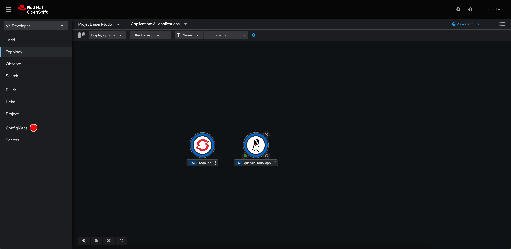
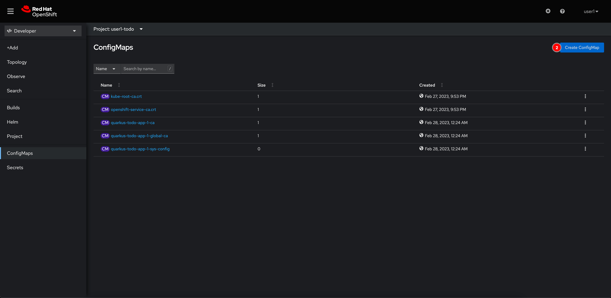
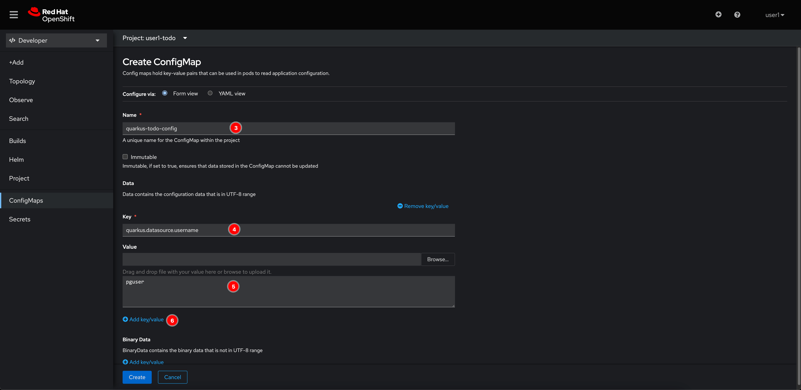
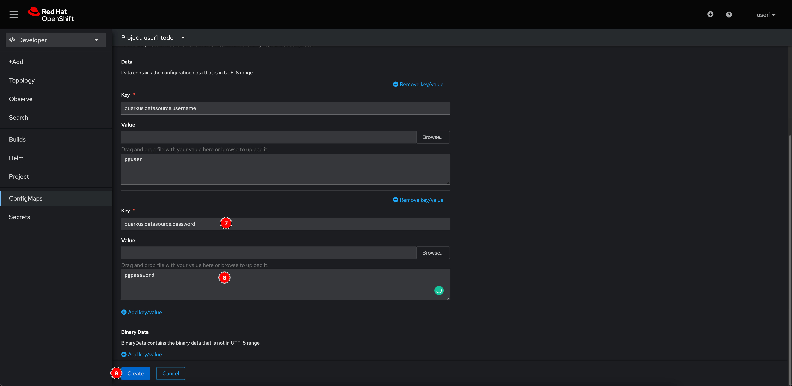
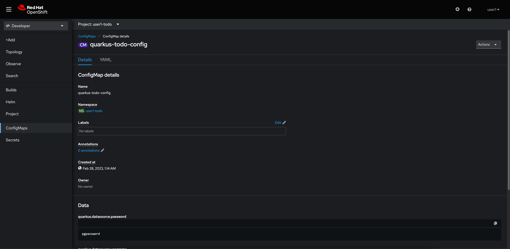
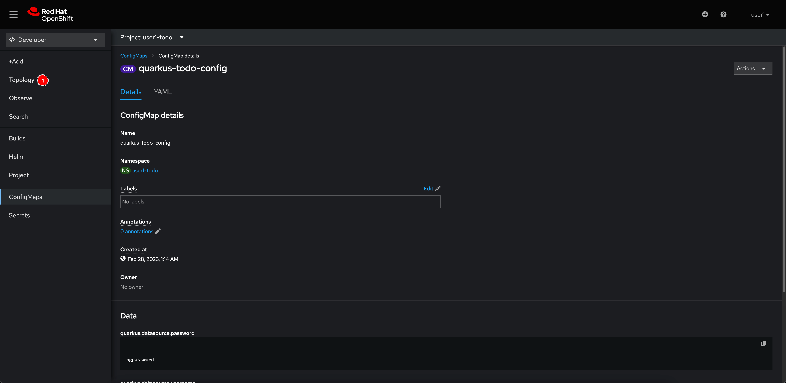
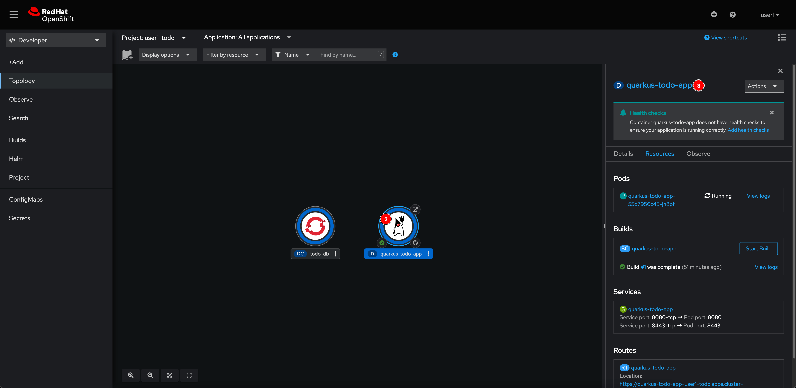
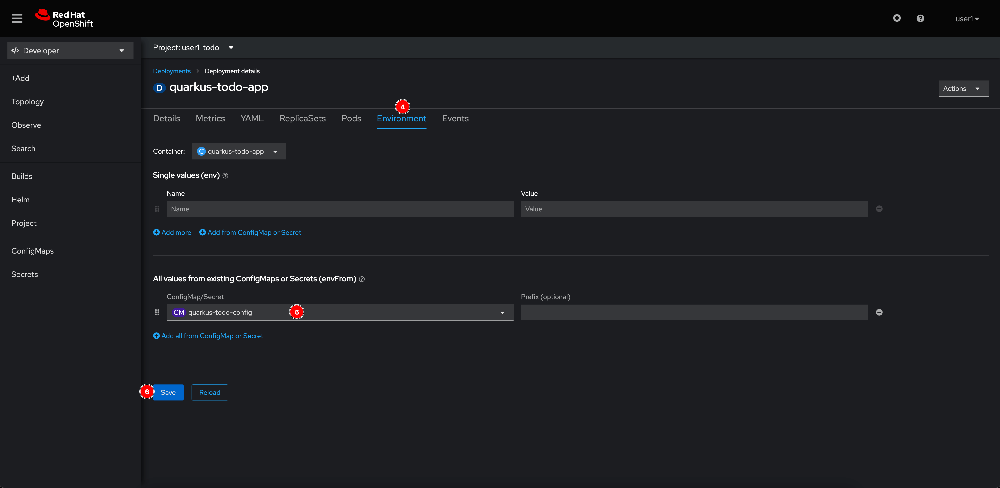
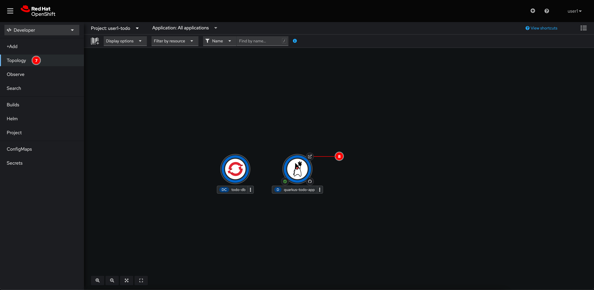

# Configure Application With ConfigMap

## Create ConfigMap

1. Select **ConfigMaps** menu.

   

2. Click on **Create ConfigMap** button.

   

3. Enter following inputs:

   - **Name:** `quarkus-todo-config`
   - **Key:** `quarkus.datasource.username`
   - **Value:** `pguser`

    Then click **Add key/value** link

   

4. Enter following inputs:

   - **Key:** `quarkus.datasource.password`
   - **Value:** `pgpassword`

    Then click **Create** button.

   

5. The new ConfigMap should be created.

   

## Configure Application

1. Go to **Topology** menu.

   

2. Select the **quarkus-todo-app** node, then click **quarkus-todo-app** Deployment link.

   

3. Go to **Environment** tab, Select the **quarkus-todo-config** ConfigMap we've just created earlier. Then click **Save** button.

   

4. Go to **Topology** menu and click on arrow icon to open application URL.

   

5. This time you should be able to see a list of todo tasks. The application can now connect to database successfully.

   
