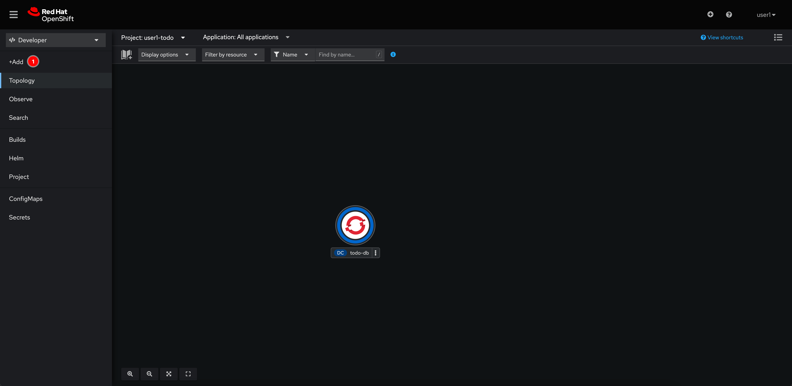
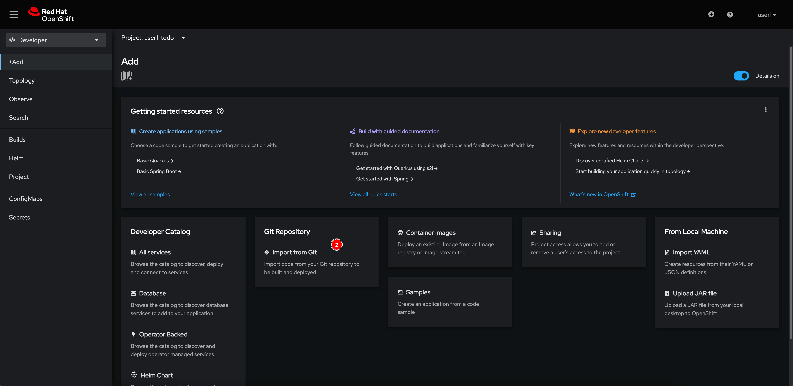
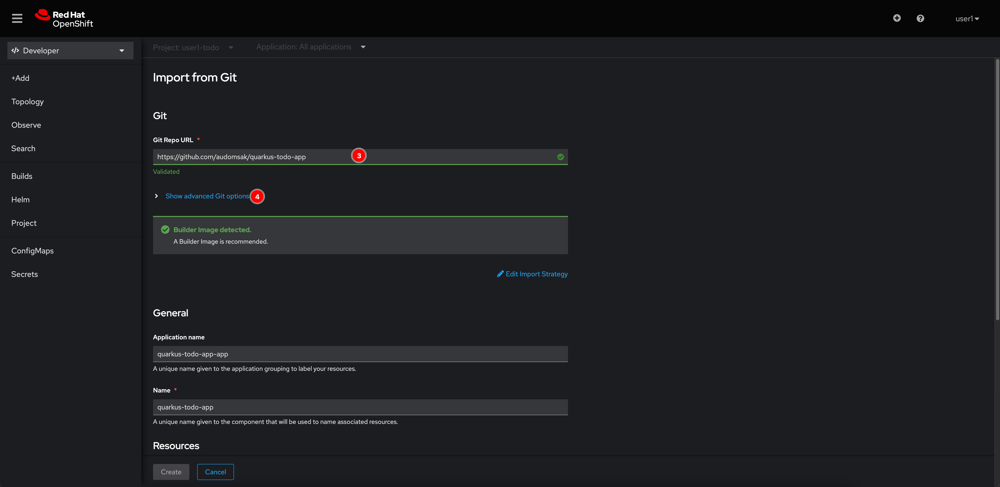
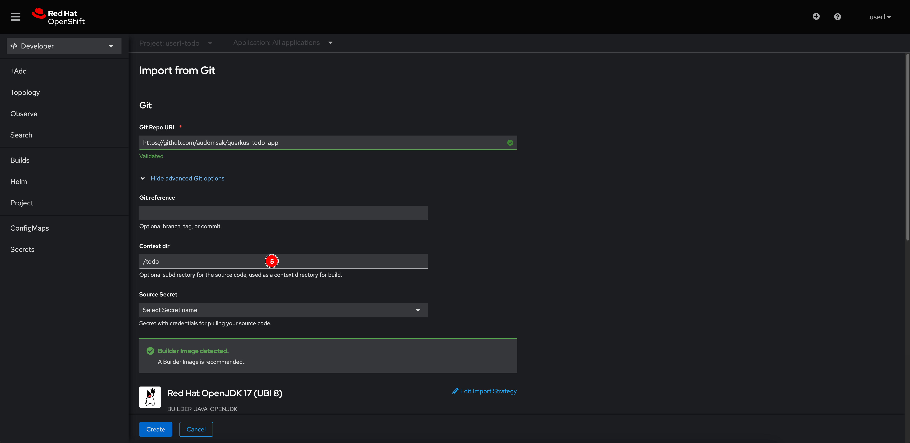
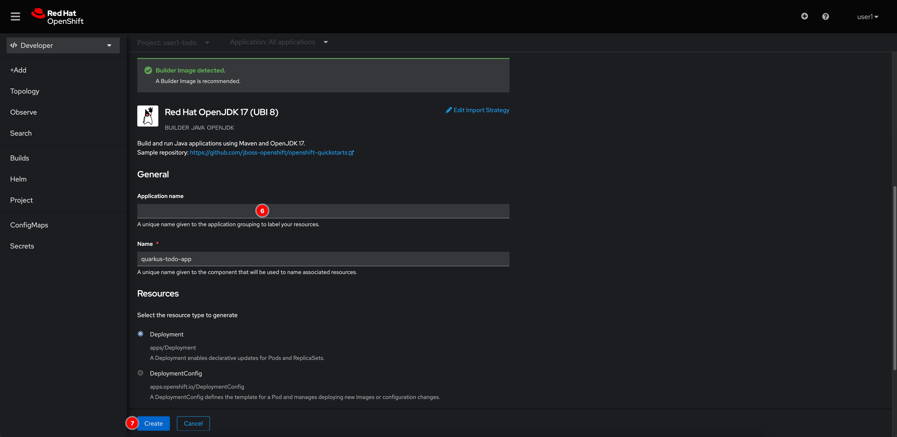
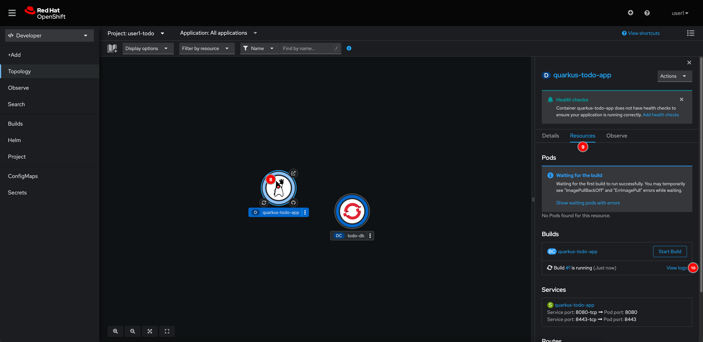
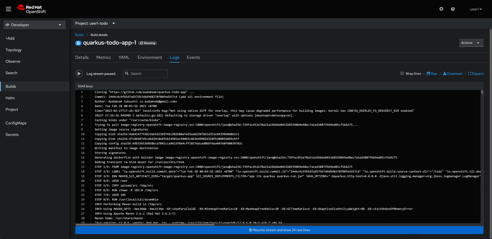
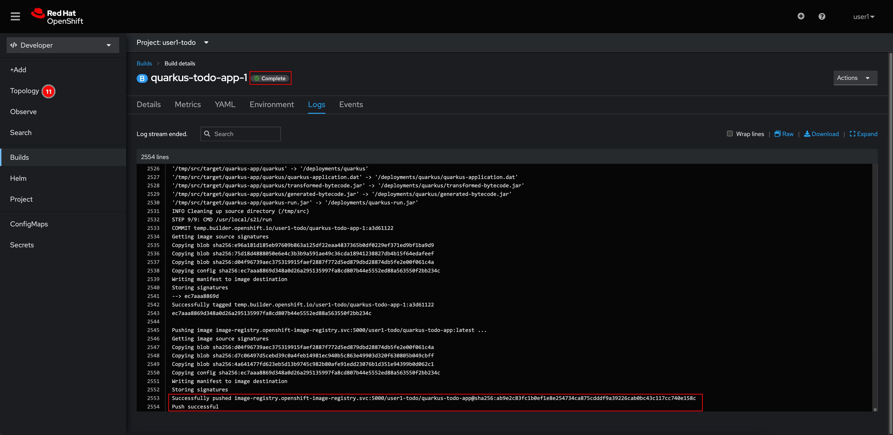
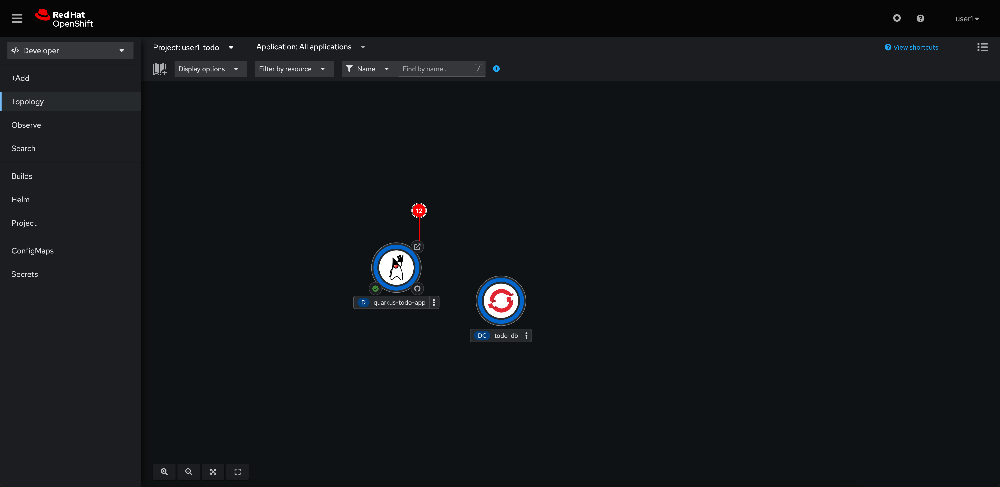

# Build And Deploy Application Using S2I (Source To Image)

1. Click **Add+** menu.

   

2. Select **Import from Git** in the Git Repository panel.

   

3. Enter **Git Repo URL** as `https://github.com/audomsak/quarkus-todo-app` then click **Show advanced Git options** link.

   

4. Enter `/todo` to the **Context dir** (this is because our application project is in the `todo` directory)

   

5. Scroll down and delete the **Application name** value. Then click **Create** button.

   

6. Click on the **quarkus-todo-app** node, then go to the **Resources** tab in the panel on the right and then click on **View logs** link to see build logs.

   

7. You should be able to see application and container image builds logs.

   

8. Wait until the build changes to `Completed`. Then select **Topology** menu to go back to the topology view.

   

9. You should be able to see the **quarkus-todo-app** node is surrounded by blue ring (it means the Pod is up and running). Click on the arrow icon to open the application URL.

   

10. Application homepage shoud show up without any todo tasks. This is because the application is currently not able to connect to PostgreSQL database.

    
