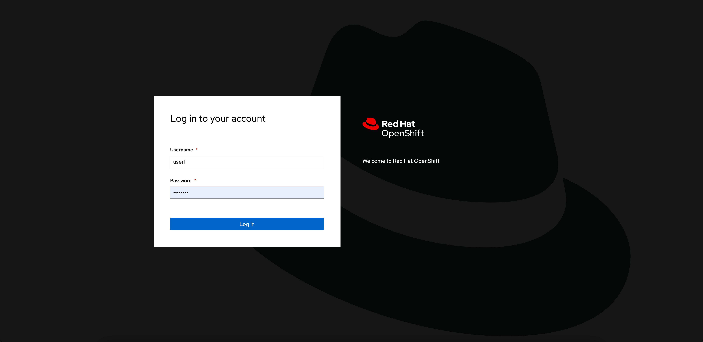
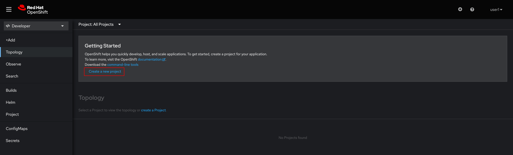
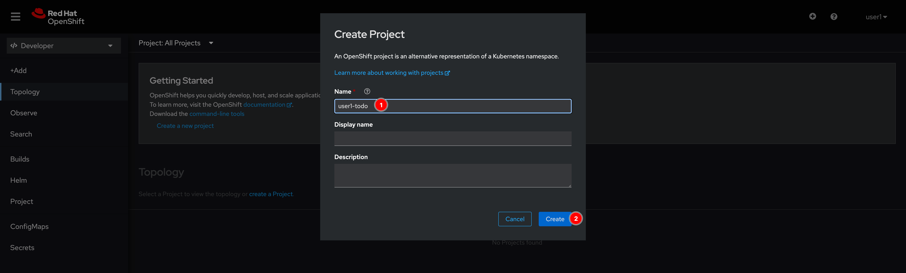
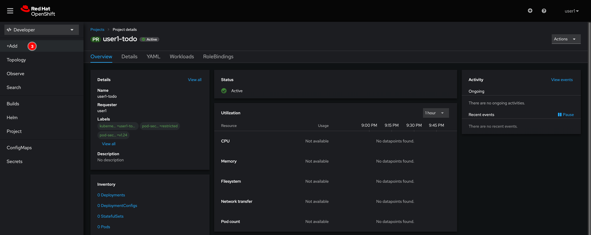
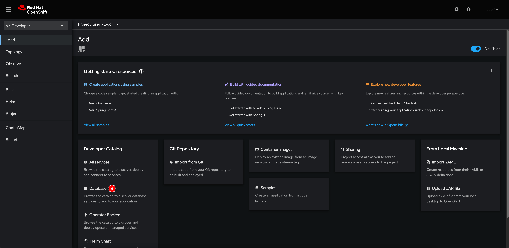
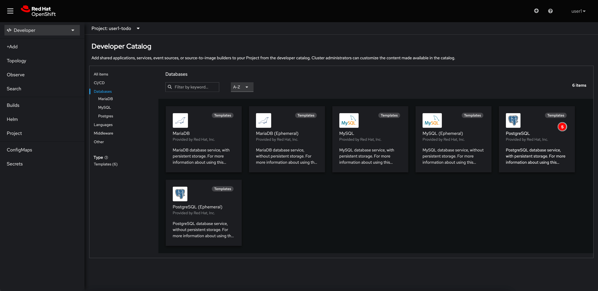
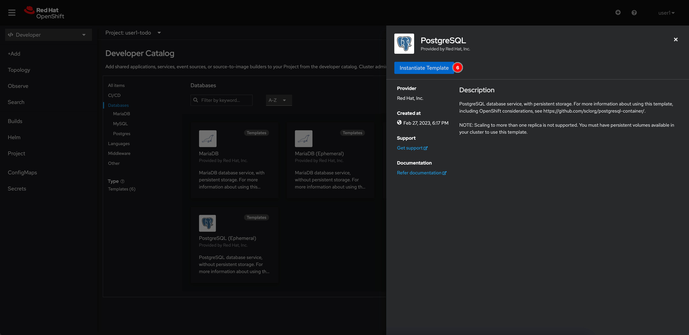
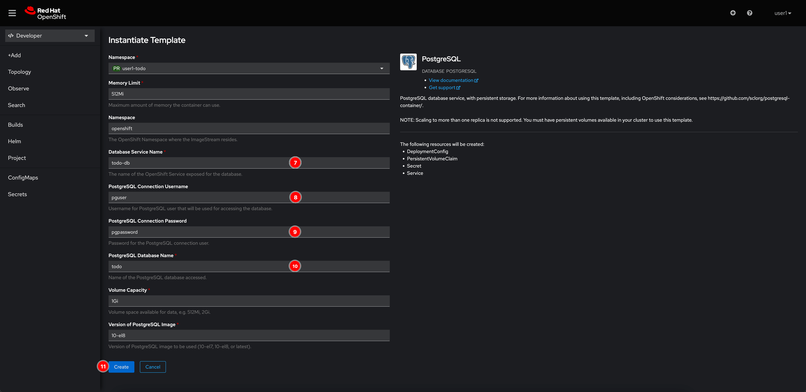
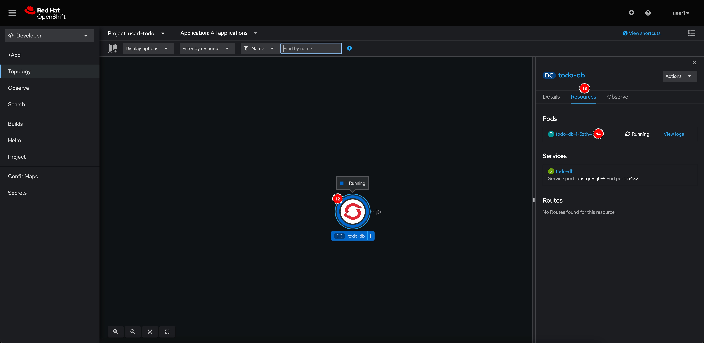

# Database Deployment Via Web Console

1. Login to OpenShift web console with the given username and password.

   

2. Click on **Skip tour** button.

   

3. Click on **Create a new project** link to create a new project (a.k.a namespace).

   

4. Enter the project name as **user*X*-todo** where _X_ is the number of your username. Then click **Create** button.

   

5. Click **Add+** menu.

   

6. Select **Database** in the Developer Catalog panel.

   

7. Select **PostgreSQL** template.

   

8. Click **Instantiate Template** button.

   

9. Enter following input:

   - **Database Service Name:** `todo-db`
   - **PostgreSQL Connection Username:** `pguser`
   - **PostgreSQL Connection Password:** `pgpassword`
   - **PostgreSQL Database Name:** `todo`

   Then click **Create** button.

   

10. Wait until the **todo-db** node is surround with blue ring then click on the node. A panel will show up on the right side, click on the **Resources** tab to see Pods and Services.

