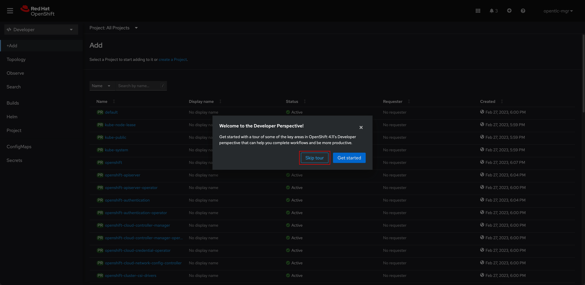

# Database Deployment Via Web Console

1. Login to OpenShift web console with the given username and password.

   

2. Click on **Skip tour** button.

   

3. Click on **Create a new project** link to create a new project (a.k.a namespace).

   

4. Enter the project name as **user*X*-todo** where _X_ is the number of your username. Then click **Create** button.

   

5. Click **Add+** menu.

   

6. Select **Database** in the Developer Catalog panel.

   

7. Select **PostgreSQL** template.

   

8. Click **Instantiate Template** button.

   

9. Enter following input:

   - **Database Service Name:** `todo-db`
   - **PostgreSQL Connection Username:** `pguser`
   - **PostgreSQL Connection Password:** `pgpassword`
   - **PostgreSQL Database Name:** `todo`

   Then click **Create** button.

   

10. Wait until the **todo-db** node is surround with blue ring then click on the node. A panel will show up on the right side, click on the **Resources** tab to see Pods and Services. Then click on the Pod name.

    

11. Go to **Terminal** tab.

    

12. Enter following command. You'll be asked to enter a password, the password is `pgpassword`.

    ```sh
    psql postgresql://todo-db:5432/todo?user=pguser
    ```

    _Example Output_

    ```sh
    psql (10.23)
    Type "help" for help.

    todo=#
    ```

13. Copy these SQL statements and paste to the terminal then press `Enter` on keyboard.

    ```sql
    drop table if exists Todo;
    drop sequence if exists hibernate_sequence;
    create sequence hibernate_sequence start 1 increment 1;
    create table Todo (
        id int8 not null,
        completed boolean not null,
        ordering int4,
        title varchar(255),
        url varchar(255),
        primary key (id)
        );
    alter table if exists Todo
        add constraint unique_title unique (title);
    INSERT INTO todo(id, title, completed, ordering, url) VALUES (nextval('hibernate_sequence'), 'Introduction to Quarkus', true, 0, null);
    INSERT INTO todo(id, title, completed, ordering, url) VALUES (nextval('hibernate_sequence'), 'Hibernate with Panache', false, 1, null);
    INSERT INTO todo(id, title, completed, ordering, url) VALUES (nextval('hibernate_sequence'), 'Visit Quarkus web site', false, 2, 'https://quarkus.io');
    INSERT INTO todo(id, title, completed, ordering, url) VALUES (nextval('hibernate_sequence'), 'Star Quarkus project', false, 3, 'https://github.com/quarkusio/quarkus/');
    ```

    _Example Output_

    ```text
    todo=# drop table if exists Todo;
    NOTICE:  table "todo" does not exist, skipping
    DROP TABLE
    todo=# drop sequence if exists hibernate_sequence;
    NOTICE:  sequence "hibernate_sequence" does not exist, skipping
    DROP SEQUENCE
    todo=# create sequence hibernate_sequence start 1 increment 1;
    CREATE SEQUENCE
    todo=# create table Todo (
    todo(#        id int8 not null,
    todo(#        completed boolean not null,
    todo(#        ordering int4,
    todo(#        title varchar(255),
    todo(#        url varchar(255),
    todo(#        primary key (id)
    todo(#     );
    CREATE TABLE
    todo=# alter table if exists Todo
    todo-#     add constraint unique_title unique (title);
    ALTER TABLE
    todo=# INSERT INTO todo(id, title, completed, ordering, url) VALUES (nextval('hibernate_sequence'), 'Introduction to Quarkus', true, 0, null);
    INSERT 0 1
    todo=# INSERT INTO todo(id, title, completed, ordering, url) VALUES (nextval('hibernate_sequence'), 'Hibernate with Panache', false, 1, null);
    INSERT 0 1
    todo=# INSERT INTO todo(id, title, completed, ordering, url) VALUES (nextval('hibernate_sequence'), 'Visit Quarkus web site', false, 2, 'https://quarkus.io');
    INSERT 0 1
    todo=# INSERT INTO todo(id, title, completed, ordering, url) VALUES (nextval('hibernate_sequence'), 'Star Quarkus project', false, 3, 'https://github.com/quarkusio/quarkus/');
    INSERT 0 1
    ```

14. Enter this command to verify if the table was created.

    ```sh
    \dt
    ```

    *Example Output*

    ```sh
            List of relations
    Schema | Name | Type  |  Owner
    --------+------+-------+----------
    public | todo | table | pguser
    (1 row)
    ```
