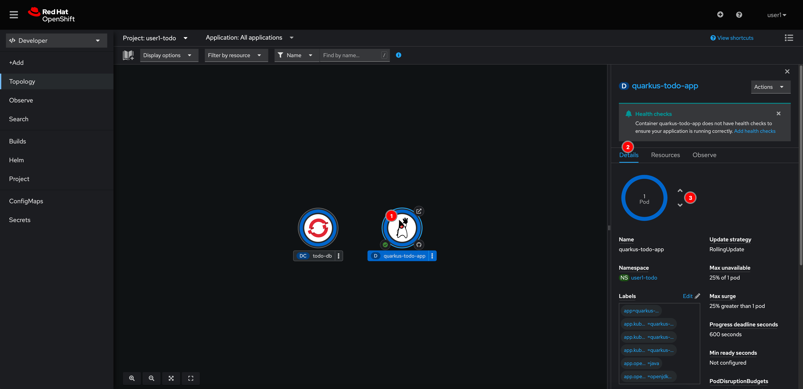

# Simple Application Scaling

To scale the application manually, select the **quarkus-todo-app** node, then go to the **Details** tab. Click on up/down arrow to scale the application up/down as you need.

Though, this is just a simple manual application scaling. You'll learn how to scale the application up/down automatically later.

