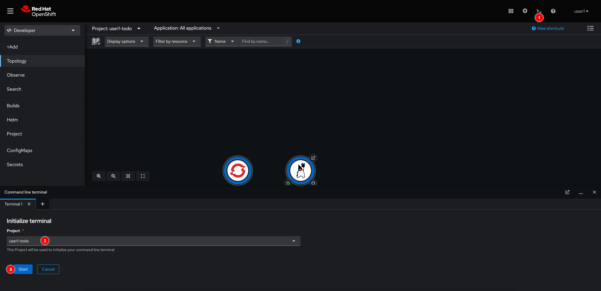
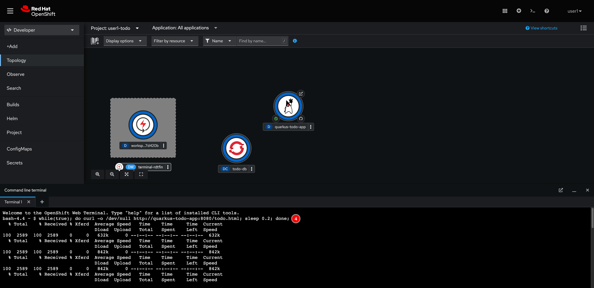
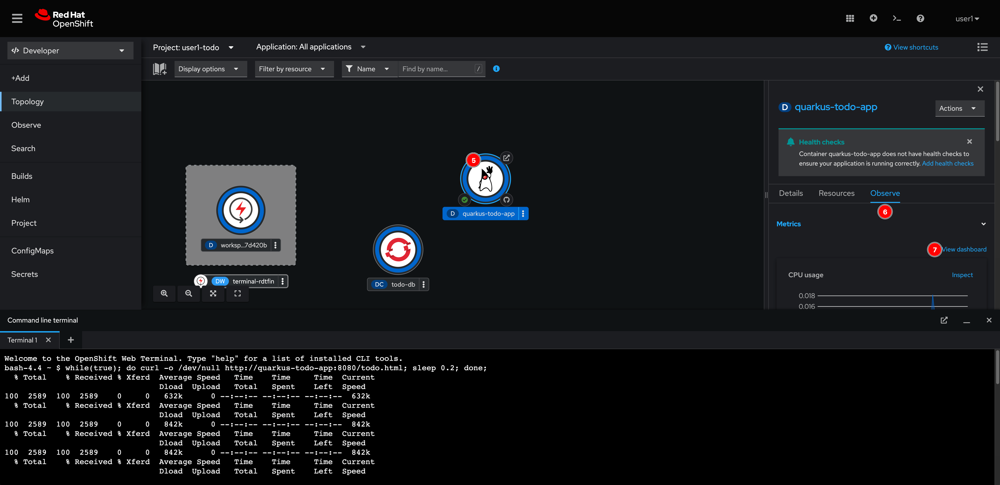
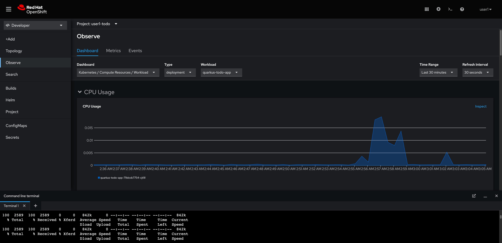
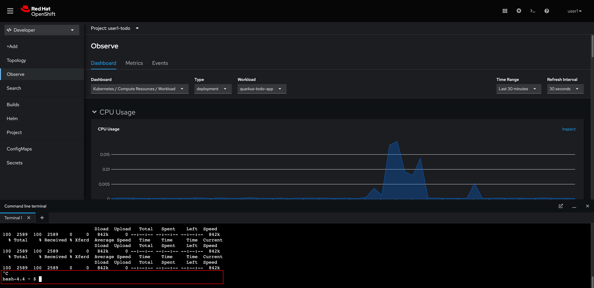

# Application Monitoring

1. Open a web terminal by click on the prompt icon at the top right corner of web console, then select your project, and click Start.

   

2. Run following command to simulate load testing.

   ```sh
   while(true); do curl -o /dev/null http://quarkus-todo-app:8080/todo.html; sleep 0.2; done;
   ```

   _Example Output_

   ```sh
   % Total    % Received % Xferd  Average Speed   Time    Time     Time  Current
                                   Dload  Upload   Total   Spent    Left  Speed
   100  2589  100  2589    0     0   842k      0 --:--:-- --:--:-- --:--:--  842k
   % Total    % Received % Xferd  Average Speed   Time    Time     Time  Current
                                   Dload  Upload   Total   Spent    Left  Speed
   100  2589  100  2589    0     0  1264k      0 --:--:-- --:--:-- --:--:-- 1264k
   ```

   

3. Select the **quarkus-todo-app** node, then go to **Observe** tab on the right panel. And then click **View dashboard** link.

   

4. You should be able to see resources consumption, throughput, bandwidth etc. for your application.

   

5. Go back to the Web Terminal and cancel the load testing script by pressing `Ctrl+C` on keyboard.

   
