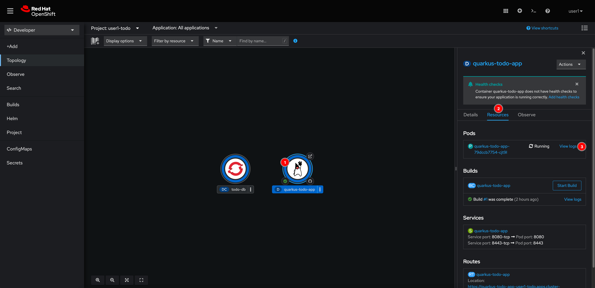
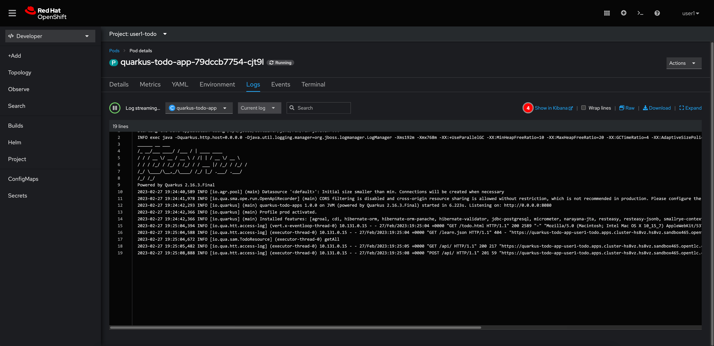
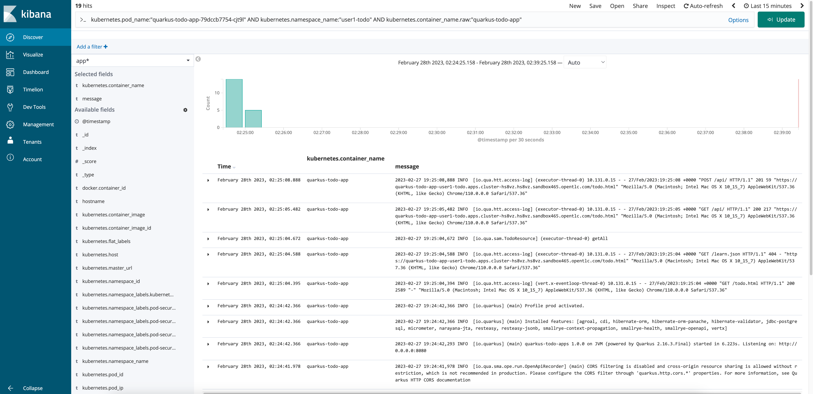

# View Application Logs

1. From the topology view, select the **quarkus-todo-app** node, then go to **Resources** tab on the right panel. And then click **View logs** for the Pod that you need to view its logs.

   

2. You should be able to see the logs from application.

   

3. OpenShift comes with logging stack (EFK) out of the box. So, you can view the application logs in Kibana as well by just click on **Show in Kibana** link.

   

4. Kibana dashboard should be opened and display application logs.

   
