# Application Health Checks

## Understand Liveness And Readiness

1. Open application URL and edit the URL by replacing `todo.html` with following path:

   - `/q/health`
   - `/q/health/live`
   - `/q/health/ready`

   Our To Do application already has the URLs which can be used to configure liveness and readiness probes.

   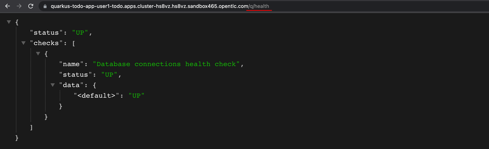

2. Go back to OpenShift web console, scale the **todo-db** Pod to 0 and now open the application URL with `/q/health/live` and `/q/health/ready` paths.

   Ideally, the application is up and running that's why the `/q/health/live` returns `"status": "UP"`. However, it cannot connect to database so it's not ready to use or serve any incoming requests so the `/q/health/ready` returns `"status": "DOWN"`

   Kubernetes/OpenShift uses application health checks for traffic routing/load balancing, auto recovery/self-healing etc.

   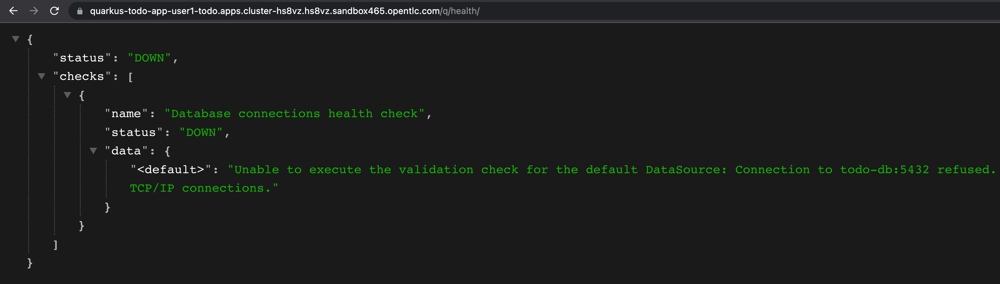

3. Scale the **todo-db** Pod back to 1 and wait until it's up and running.

## Setting The Probes

1. Select the **quarkus-todo-app** node, click on the **Actions** drowdownlist menu then select **Add Health Checks**.

   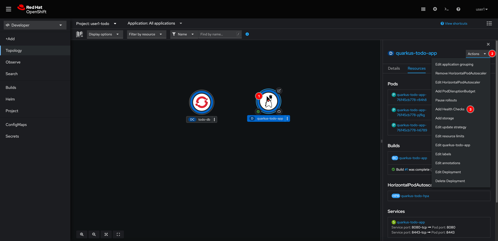

2. Click **Add Readiness probe** link.

   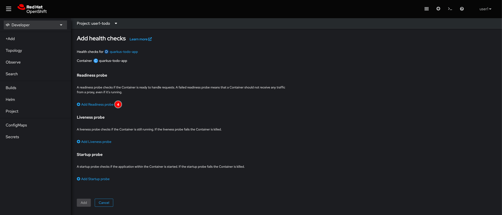

3. Enter `/q/health/ready` as the **Path** value. Then click on the check button.

   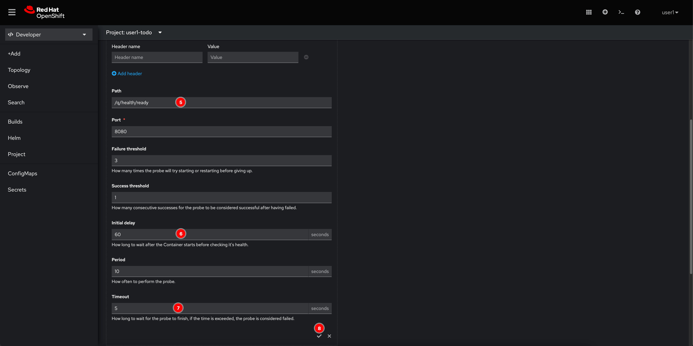

4. Click **Add Liveness probe** link.

   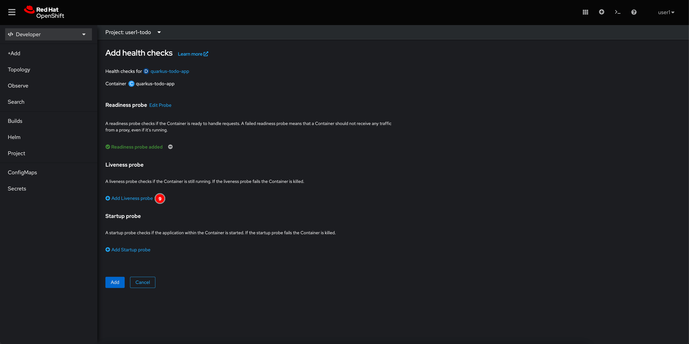

5. Enter `/q/health/live` as the **Path** value. Then click on the check button.

   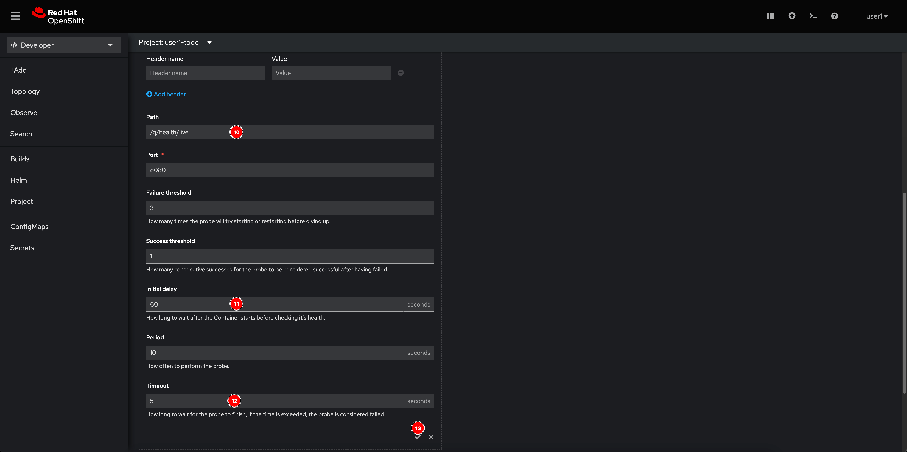

6. Click **Add** button.

   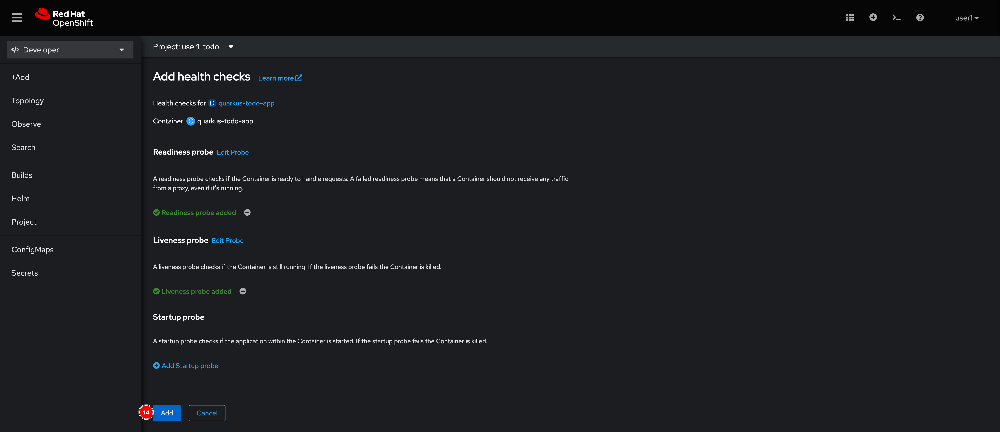

7. Deployment object will deploy a new Pod with health checks settings and terminate the old one. Wait until this get completed.

   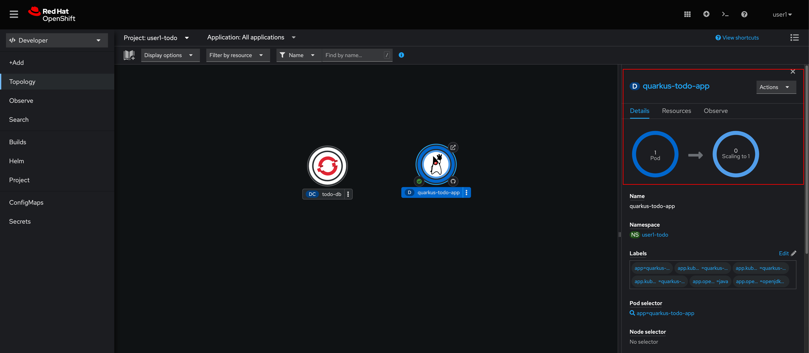

8. Go to **Resources** tab and click **View logs** link.

   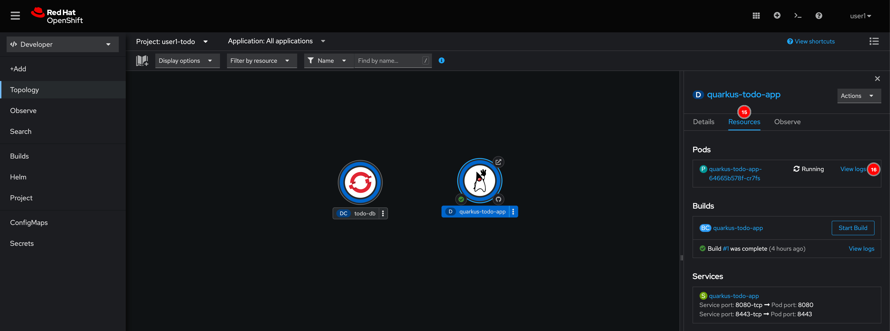

9. You should see the logs indicate that `/q/health/ready` and `/q/health/live` URLs get called by `kube-probe` agent. Basically, Kubernetes/OpenShift will keep doing application health checks.

   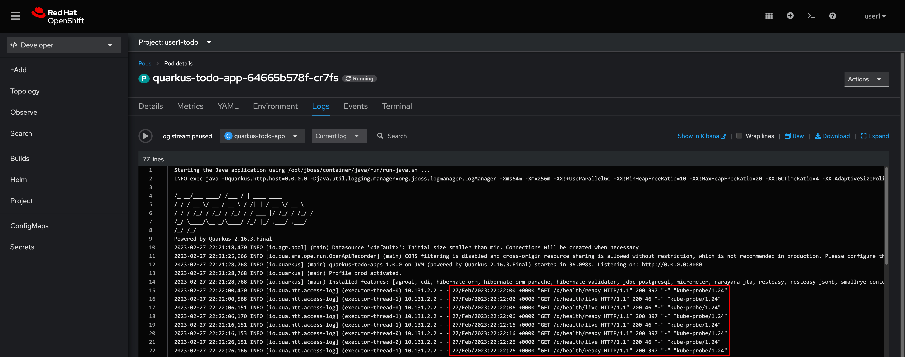
