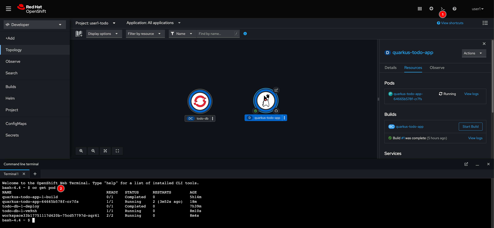
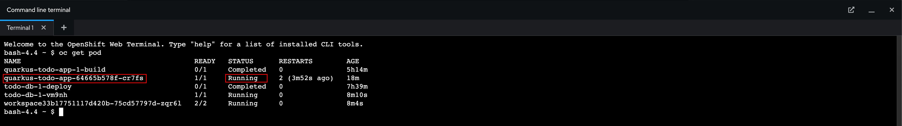

# Application Auto Recovery (Self-Healing)

1. Open the Web Terminal then run this command.

   ```sh
   oc get pod
   ```

   

2. Look for the Pod with the name as `quarkus-todo-app-xxxxxxx` and it's status is `Running`. Please note/observe the `RESTARTS` value as well.

   

3. Run this command to get into the container. Don't forget to replace the `POD_NAME` with your **quarkus-todo-app-xxxxxxx** pod.

   ```sh
   oc rsh POD_NAME
   ```

4. Kill the Java application process with this command.

   ```sh
   kill 1
   ```

5. Observe the web console you'll see some animation.

   

6. Run this command again and observe the `RESTARTS` value. Basically, Kubernetes/OpenShift will keep checking the Pod status for us, if it's not ready, Kubernets assume that the application container might have some issue and it'll try to restart the the container automatically.

   ```sh
   oc get pod
   ```
