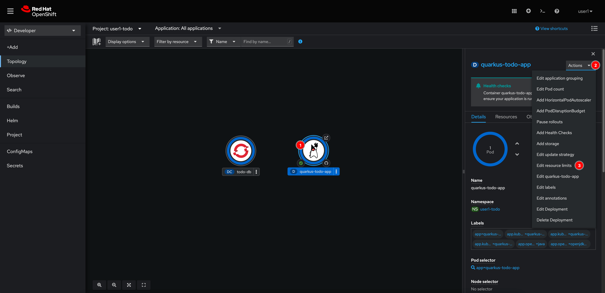
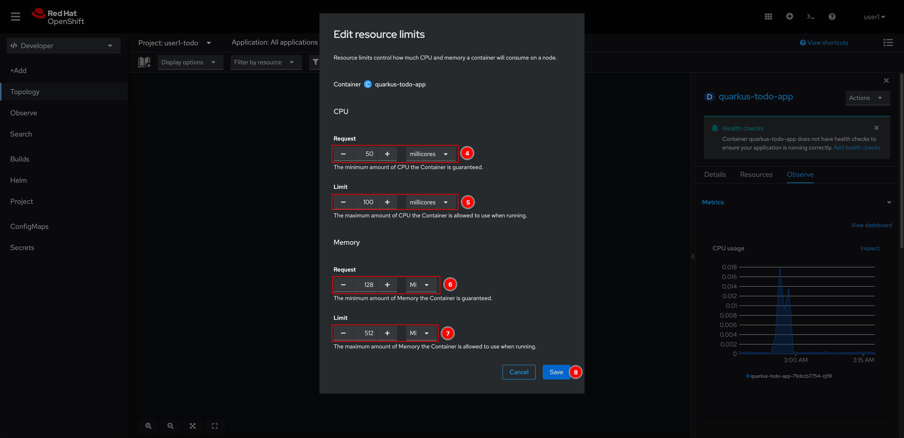

# Resources Allocation For Application

1. Select the **quarkus-todo-app** node, click on the **Actions** drowdownlist menu then select **Edit resource limits**.

   

2. Enter following inputs:

   - **CPU**

     - **Request:** `50 millicores`
     - **Limit:** `100 millicores`

   - **Memory**
     - **Request:** `128 Mi`
     - **Limit:** `512 Mi`

   Then click **Save** button.

   

3. The Deployment will redeploy a new Pod with configured resources.
