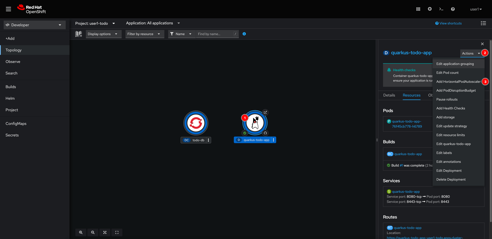
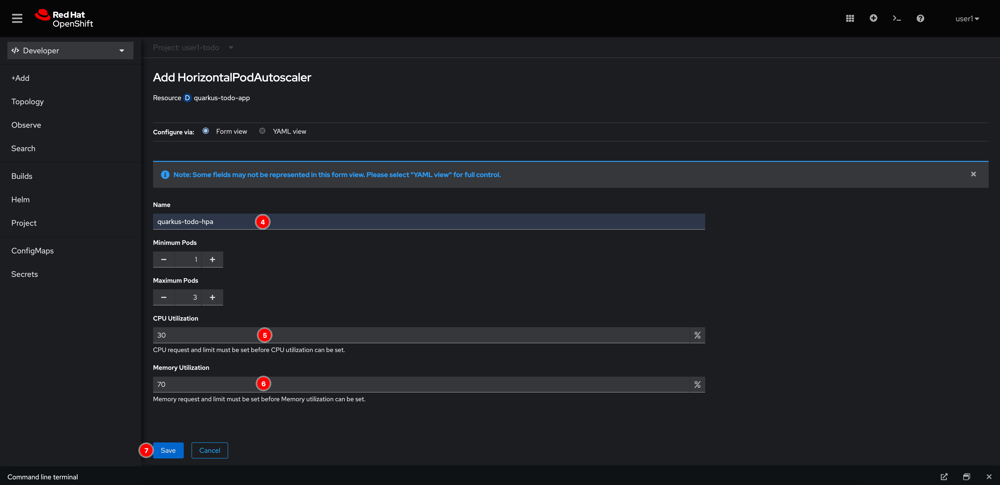
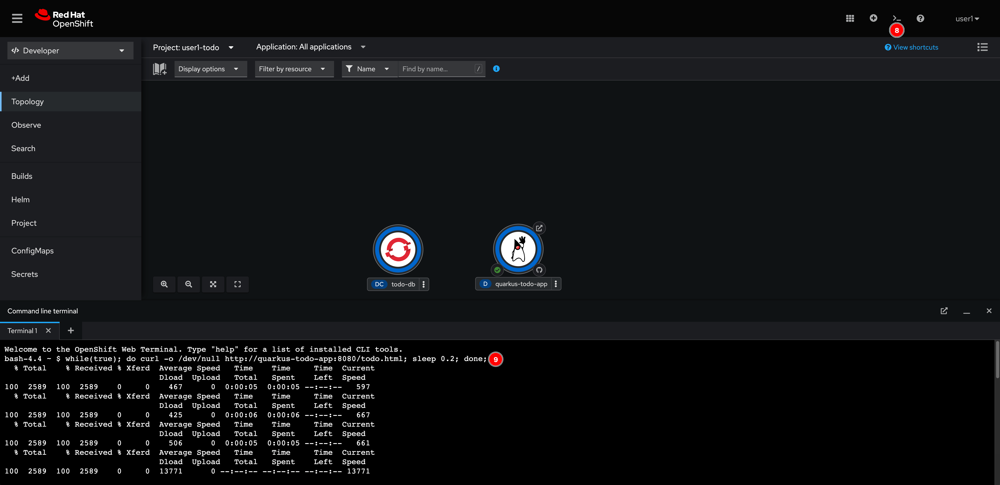
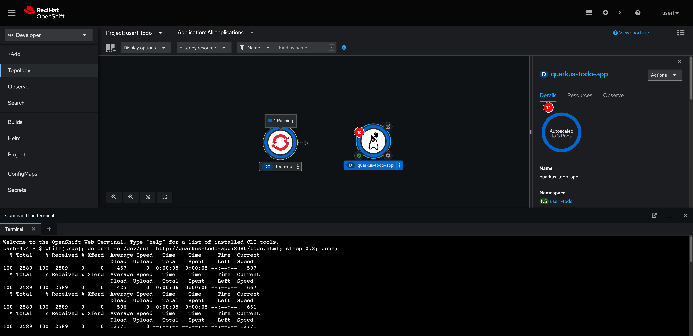

# Scale Application Automatically

1. Select the **quarkus-todo-app** node, click on the **Actions** drowdownlist menu then select **Add HorizontalPodAutoscaler**.

   

2. Enter following inputs:

   - **Name:** `quarkus-todo-hpa`
   - **CPU Utilization:** `30`
   - **Memory Utilization:** `70`

   Then click **Save** button.

   

3. Open the Web Terminal and run this command to simulate load testing.

   ```sh
   while(true); do curl -o /dev/null http://quarkus-todo-app:8080/todo.html; sleep 0.2; done;
   ```

   

4. Select the **quarkus-todo-app** node, then go to **Details** tab. Notice that the Pods are automatically scaled and you're not allow to scale the pods manually.

   

5. Go back to the Web Terminal and cancel the load testing command by pressing `Ctrl+C` on keyboard.
